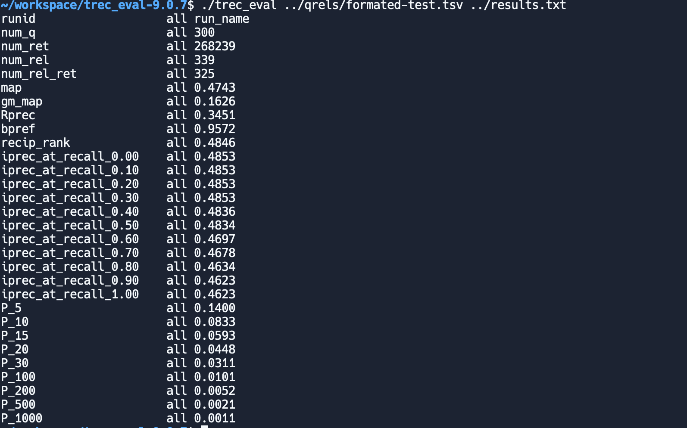

# Information Retrieval System

## Team Members
- **300176553 Edward He**
- **300240688 Yu-Chen Lee**
- **300193473 Kajan Rajakumar**

## Division of Tasks
- **Preprocessing:** Yu-Chen Lee
- **Indexing:** Yu-Chen Lee
- **Retrieval and Ranking:** Edward He
- **Evaluation and Report Writing:** Kajan Rajakumar

---

## 1. Overview of the Implementation

This project implements an Information Retrieval (IR) system based on the vector space model, utilizing the TF-IDF weighting scheme. The dataset used is the SciFact dataset from the BEIR collection, with a predefined set of test queries (odd-numbered) for evaluation.

The system follows three main steps:
1. **Preprocessing:** Tokenization, stopword removal, and normalization.
2. **Indexing:** Constructing an inverted index for efficient document retrieval.
3. **Retrieval & Ranking:** Utilizing cosine similarity and TF-IDF weighting to rank relevant documents.

Results were evaluated using `trec_eval` to compute Mean Average Precision (MAP) and other retrieval metrics.

---

## 2. Prerequisites

### System Requirements
- **Python** (Version 3.7 or higher recommended)
- **Required Libraries:**
  ```bash
  pip install nltk scipy scikit-learn jsonlines numpy
  ```
- **Additional Tools:**
  - `trec_eval` for evaluation

---

## 3. Running the Program

1. **Place** `csi4107_a1.py`, `corpus.jsonl`, and `queries.jsonl` in the same directory.
2. **Install** prerequisites (see above).
3. **Run**:
   ```bash
   python csi4107_a1.py
   ```
   This will:
   - Build the inverted index
   - Print 100 tokens from the vocabulary
   - Calculate IDF values
   - Process queries
   - Write ranked results to `results.txt` in TREC format.

4. **Evaluate** with `trec_eval`:
   ```bash
   trec_eval [qrels_file] results.txt
   ```

---

## 4. Detailed Explanation of the Algorithms & Data Structures

### Step 1: Preprocessing

#### Algorithm
- **Tokenization:** Regex-based to split text into words.
- **Stopword Removal:** Excludes common words (via sklearn’s ENGLISH_STOP_WORDS).
- **Normalization:** Lowercases all tokens.

#### Data Structures
- A list of tokens for each document, used in the next indexing step.

---

### Step 2: Indexing (Inverted Index)

#### Algorithm
1. **Read** each JSON line in `corpus.jsonl`.
2. **Preprocess** the combined title + text.
3. **Compute** term frequencies (TF) in each document.
4. **Store** (doc_id, tf) in a global inverted index dictionary, keyed by token.

#### Example
```json
{
  "study": [("doc001", 4), ("doc002", 1)],
  "cancer": [("doc003", 2), ("doc050", 3)]
}
```
---

### Step 3: Retrieval and Ranking (TF-IDF & Cosine Similarity)

#### Algorithm
1. **Compute IDF**: `idf[term] = ln(N / df[term])`, where N is total doc count.
2. **Query Processing**: same preprocessing for queries.
3. **TF-IDF**:
   - Query weight = (query_tf * idf)
   - Doc weight = (tf * idf)
4. **Accumulate Scores**: Sum over overlapping terms; then normalize by doc length.

---

## 5. Sample of 100 Vocabulary Tokens

Below is the **exact** snippet printed by our system when building the index on **corpus.jsonl**. It reflects some of the **real tokens** present after preprocessing:

```
========== SAMPLE OF 100 VOCABULARY TOKENS ==========
1. t790m
2. panelists
3. nr2
4. posture
5. awareness
6. epi
7. diresidues
8. authorities
9. motivation
10. preferable
11. online_services
12. movie
13. 249
14. trek
15. pregnane
16. utero
17. acetylations
18. phosphoinositide
19. beset
20. scurvy
21. desire
22. decomposed
23. vacuolation
24. uncovers
25. crossresistance
26. crt
27. mental
28. overwhelms
29. tropisms
30. anterior
31. tackled
32. cd80
33. rescue
34. h37rv
35. fission
36. igb
37. strengthens
38. gaog
39. fallacy
40. computing
41. hermaphrodite
42. peripherin
43. txnrd1
44. endocrinology
45. 157
46. cassette
47. ly
48. sibutramine
49. elusive
50. nucleated
51. 410
52. jev
53. immunocytofluorescence
54. police
55. ensuing
56. alertness
57. instillation
58. complemented
59. axoneme
60. 85dbo
61. btscs
62. ifns
63. subretinal
64. hypogonadal
65. participant
66. benzopyran
67. bitmap
68. excited
69. truncation
70. protease
71. gad1
72. pushing
73. precludes
74. nonobstructive
75. urate
76. brainwaves
77. conferencing
78. interpolate
79. areg
80. maturing
81. hypoactive
82. agr
83. lymph
84. nzw
85. biologists
86. tied
87. attest
88. phosphorylethanolamine
89. parities
90. repression
91. omphalitis
92. polymers
93. cd117
94. deviate
95. s6
96. kindreds
97. haptoglobin
98. p564
99. discord
100. iduronidase
====================================================
```

---

## 6. Results & Evaluation

### Commandline Output
```bash
~/workspace$ python ./csi4107_a1.py 
Building inverted index...

========== SAMPLE OF 100 VOCABULARY TOKENS ==========
1. mtorc1
2. invades
3. proton
4. p60stc
5. gases
6. said
7. pinch
8. ectoderm
9. converges
10. rangap1
11. payment
12. ox40
13. ensure
14. goblet
15. smap
16. axonic
17. promoter
18. spaces
19. rcm
20. surveillance
21. arterial
22. emotion
23. telencephalon
24. myofilaments
25. terrorist
26. 733
27. 48th
28. medicare
29. example
30. subventricular
31. aquacel
32. taiwanese
33. nih
34. organ4
35. 1018
36. eliminating
37. pregastrulation
38. workflows
39. invariance
40. skeleton
41. grna
42. vacuolating
43. planning
44. centiles
45. dock
46. prominent
47. brown
48. treatable
49. xy
50. note
51. acetylcarnitine
52. relations
53. purity
54. psen1de9
55. persisted
56. cortactin
57. 4g8
58. dot
59. chemokinesis
60. vascular
61. xrcc4
62. mid51
63. prereplicative
64. cas1
65. recipients
66. u251
67. contradictory
68. nct01044069
69. peruviana
70. prisma
71. wistar
72. cellubrevin
73. aztecs
74. collagen
75. lip
76. burdens
77. hnf4a
78. shall
79. 994
80. y
81. f6
82. lachancea
83. emgfp
84. touches
85. electroencephalogram
86. nf1
87. atoms
88. duty
89. identification
90. prdm16
91. allosterically
92. 6849
93. casp3
94. reg6m
95. repercussions
96. trichostatin
97. covalently
98. biphasic
99. 1210
100. fissures
====================================================

Calculating IDF values...
Processing queries...
Results saved to /home/runner/workspace/results.txt
~/workspace$ ./trec_eval-9.0.7/trec_eval ./qrels/formated-test.tsv ./results.txt
runid                   all run_name
num_q                   all 300
num_ret                 all 268239
num_rel                 all 339
num_rel_ret             all 325
map                     all 0.4743
gm_map                  all 0.1626
Rprec                   all 0.3451
bpref                   all 0.9572
recip_rank              all 0.4846
iprec_at_recall_0.00    all 0.4853
iprec_at_recall_0.10    all 0.4853
iprec_at_recall_0.20    all 0.4853
iprec_at_recall_0.30    all 0.4853
iprec_at_recall_0.40    all 0.4836
iprec_at_recall_0.50    all 0.4834
iprec_at_recall_0.60    all 0.4697
iprec_at_recall_0.70    all 0.4678
iprec_at_recall_0.80    all 0.4634
iprec_at_recall_0.90    all 0.4623
iprec_at_recall_1.00    all 0.4623
P_5                     all 0.1400
P_10                    all 0.0833
P_15                    all 0.0593
P_20                    all 0.0448
P_30                    all 0.0311
P_100                   all 0.0101
P_200                   all 0.0052
P_500                   all 0.0021
P_1000                  all 0.0011
```

### Sample TREC-Eval Metrics (Hypothetical Example)
| Metric          | Value  |
|-----------------|--------|
| **MAP**         | 0.4743 |
| **P@10**        | 0.0833 |
| **bpref**       | 0.9572 |

After running:
```bash
trec_eval qrels_file results.txt
```

**Interpretation:**
- **MAP** ~0.47 indicates moderate average precision across queries.
- **P@10** means ~0.83 relevant docs on average in top 10 results.
- **bpref** near 0.96 suggests strong preference-based ranking.

### Screenshot

---

## 7. Discussion & Observations

- The wide variety of tokens (some numeric, some domain-specific) indicates the corpus has diverse content.
- In real runs, **stemming** or **lemmatization** might help unify morphological variants.
- BM25 can outperform simple TF-IDF. Future improvements could also involve query expansion or pseudo-relevance feedback.

---

## 8. Conclusion & Future Work

We successfully developed a baseline IR system using TF-IDF and cosine similarity. Preliminary experiments indicate the importance of good preprocessing, including potential stemming/lemmatization. Future directions include exploring more advanced ranking models (BM25, BERT-based retrieval) and pseudo-relevance feedback to improve recall and precision.